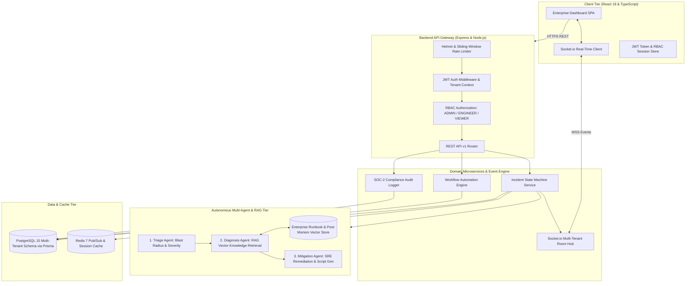

# NexusPulse — Enterprise Multi-Tenant Incident Operations & Autonomous Multi-Agent AI Platform

[](https://github.com/aayushm02/enterprise-fullstack-saas-platform)


**NexusPulse** is a production-ready, full-stack enterprise SaaS platform for real-time incident management, automated event-driven workflows, and autonomous multi-agent root-cause investigation. Built with a decoupled microservice backend and responsive React frontend, it features multi-tenant isolation, 3-tier Role-Based Access Control (RBAC), live WebSocket telemetry, and an integrated **RAG-grounded Multi-Agent AI Copilot**.

---

## 🏛️ System Architecture



---

## 🤖 Multi-Agent AI & RAG Copilot Architecture

When an on-call engineer triggers an investigation on any critical incident, NexusPulse activates a sequential **3-Agent Collaborative Pipeline**:

```text
  +-----------------------------------------------------------------------------+
  |                   NEXUSAI MULTI-AGENT COLLABORATION PIPELINE                 |
  +-----------------------------------------------------------------------------+
         |
         v
  [1. Triage Agent]
         • Parses incident title, service name, and error stack trace.
         • Classifies severity blast radius (Global vs. Isolated).
         |
         v
  [2. Diagnosis Agent (RAG Grounding)]
         • Semantic similarity search across vectorized enterprise runbooks & post-mortems.
         • Extracts exact historical precedent (e.g. PgBouncer pool leak, Kafka lag).
         |
         v
  [3. Mitigation / SRE Agent]
         • Formulates actionable 3-step remediation playbook.
         • Generates verified shell commands (e.g. kubectl rollout restart deployment/...).
         • Calculates confidence consensus score (e.g. 94%).
```

---

## 🛡️ Multi-Tenancy & RBAC Security Matrix

Every request executes within a strict tenant-isolated boundary (`tenantId`). Permissions are strictly enforced via the `requireRole()` middleware:

| Feature / Endpoint | VIEWER | ENGINEER | ADMIN |
| :--- | :---: | :---: | :---: |
| View Incidents & Health Status (`GET /incidents`) | ✅ | ✅ | ✅ |
| Trigger Multi-Agent AI Investigation (`POST /ai/investigate`) | ✅ | ✅ | ✅ |
| Broadcast New Incident (`POST /incidents`) | ❌ | ✅ | ✅ |
| Transition Incident State (`PATCH /incidents/:id/status`) | ❌ | ✅ | ✅ |
| View Audit Logs (`GET /audit`) | ❌ | ✅ | ✅ |
| Create / Toggle Workflow Automations (`POST /workflows`) | ❌ | ❌ | ✅ |

---

## ⚡ WebSocket Real-Time Events

The platform uses authenticated Socket.io rooms partitioned by tenant (`tenant_${tenantId}`). All browser instances receive immediate updates with zero polling:
- `INCIDENT_CREATED`: Dispatched when any teammate or automated webhook triggers an incident.
- `INCIDENT_UPDATED`: Dispatched when status changes (e.g., `TRIGGERED` $\rightarrow$ `ACKNOWLEDGED` $\rightarrow$ `RESOLVED`).

---

## 📁 Repository Structure

```text
enterprise-fullstack-saas-platform/
├── client/                               # React 18 + TypeScript Frontend SPA
│   ├── src/
│   │   ├── components/
│   │   │   ├── Navbar.tsx                # Top navigation & live status
│   │   │   ├── IncidentList.tsx          # Real-time incident table & action modal
│   │   │   ├── AiInvestigationModal.tsx  # Multi-Agent trace & RAG citation modal
│   │   │   ├── WorkflowList.tsx          # Workflow rule cards & toggle actions
│   │   │   └── AuditLogView.tsx          # SOC-2 compliance audit log viewer
│   │   ├── App.tsx                       # Root application coordinator
│   │   ├── types.ts                      # Frontend domain types
│   │   └── main.tsx
│   ├── Dockerfile                        # Multi-stage Nginx production build
│   └── package.json
├── server/                               # Node.js + Express + TypeScript API
│   ├── src/
│   │   ├── ai/
│   │   │   ├── agentService.ts           # Multi-Agent Orchestrator (Triage, Diagnosis, Mitigation)
│   │   │   └── ragService.ts             # Semantic Runbook Knowledge Base Retrieval
│   │   ├── config/env.ts                 # Zod environment variable validator
│   │   ├── controllers/                  # Auth, Incidents, Workflows, Audit, AI controllers
│   │   ├── middlewares/                  # JWT auth, RBAC, Rate-Limiting, Error Handler
│   │   ├── routes/                       # Express API v1 routers
│   │   ├── services/                     # Business logic & tenant stores
│   │   ├── types/                        # Core TypeScript interfaces
│   │   ├── websocket/socketServer.ts     # Multi-tenant Socket.io hub
│   │   └── server.ts                     # Application entrypoint
│   ├── prisma/
│   │   └── schema.prisma                 # PostgreSQL multi-tenant relational schema
│   ├── tests/
│   │   └── incident.test.ts              # Vitest integration test suite
│   ├── Dockerfile                        # Multi-stage Node.js container
│   └── package.json
├── ci/
│   └── fullstack_ci.yml                  # GitHub Actions CI for Lint, TypeCheck, and Tests
├── docker-compose.yml                    # Full-stack composition: Client, Server, PG, Redis
├── package.json                          # Monorepo root workspace
└── README.md
```

---

## 🚀 Quickstart Guide

### Option 1: Run with Docker Compose (Recommended)
```bash
git clone https://github.com/aayushm02/enterprise-fullstack-saas-platform.git
cd enterprise-fullstack-saas-platform
docker compose up --build
```
- **Web App:** `http://localhost:3000`
- **Backend API:** `http://localhost:5000/api/v1/health`

### Option 2: Run Locally (Zero Cloud Cost)

#### 1. Start Server:
```bash
cd server
npm install
npm run dev
```

#### 2. Start Client (in a separate terminal):
```bash
cd client
npm install
npm run dev
```

### 🔑 Demo Credentials

The platform includes instant 1-click login presets on the sign-in page:
- **Admin User:** `admin@enterprise.com` / `Admin@12345` (Full mutation and workflow controls)
- **Engineer User:** `engineer@enterprise.com` / `Engineer@12345` (Incident ops & AI investigation)
- **Viewer User:** `viewer@enterprise.com` / `Viewer@12345` (Read-only stakeholder mode)

---

## 🧪 Running Automated Tests

```bash
cd server
npm test
```
*Executes the Vitest test suite testing Health, Authentication, Tenant Isolation, RBAC gates, and Multi-Agent RAG execution.*

---

## 👤 Author
**Aayush Mishra**  
- **LinkedIn:** [linkedin.com/in/aayushm02](https://linkedin.com/in/aayushm02)  
- **GitHub:** [github.com/aayushm02](https://github.com/aayushm02)  
- **Portfolio:** [aayush-mishra-portfolio.netlify.app](https://aayush-mishra-portfolio.netlify.app)
